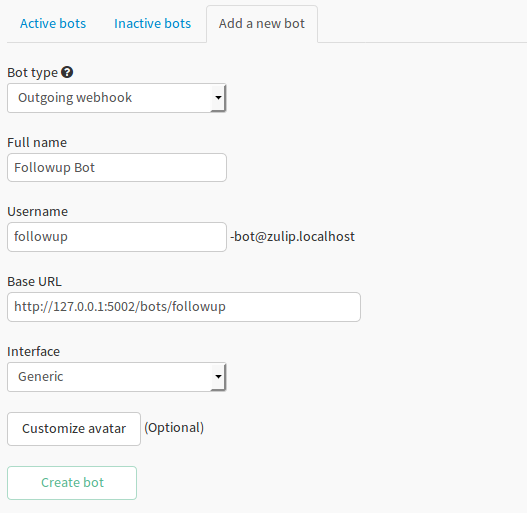

# Outgoing Webhooks

These are a type of integration which post data to third party URLs through a HTTP POST request.
To create an outgoing webhook, create an outgoing webhook bot from add new bot ui, with following details:
* **Bot type**: outgoing webhook
* **Full name, Username**: as desired, the username will be taken as name of outgoing webhook.
* **Base URL**: desired URL to which data is to be posted
* **Interface**: generic for simple outgoing webhooks, else desired interface as per use.





## Editing the details:
**Base URL** and **Interface** for an outgoing webhook can be edited by users, through the `edit bot` form.
To open the `edit bot` form, go to the `Active bots` tab, and for the outgoing webhook bot to be edited,
click on the pencil shaped icon below the bot's name.


## Triggering
There are currently two methods to trigger an outgoing webhook:
1.  **@-mentioning the bot which is the owner of outgoing webhook**

    The bot you created through `Add new bot` ui is the owner of the outgoing webhook.
    In this case the outgoing webhook will send the response in the same stream where it was triggered.
    Note: make sure that the bot is subscribed to the stream where it is to be triggered.

2.  **Sending a private message to the bot**

    This can be both 1:1 messages or a group message. The outgoing webhook would send the response in the
    private message space where it was triggered.


## Data posted
The data posted varies according to the interface used. To know about the data posted to URL, refer interfaces.


## Interfaces
These are classes which customise the data to be posted to base URL of outgoing webhooks. These also provide
methods to prepare data to be posted and help parse the response from the URL and generate the response
to be sent to the user. For specialised purpose, user can create his own interface, else he can use
the above interfaces supported by zulip.

*   **Generic**

    It is useful for general purpose webhooks. It posts the the following data:

    ```
    data:       content of message in a more readable format
    token:      string of alphanumeric characters for identifying service on external URL servers
    message:    the message which triggered outgoing webhook
    ├── id
    ├── sender_email
    ├── sender_full_name
    ├── sender_short_name
    ├── sender_realm_str
    ├── sender_id
    ├── type
    ├── display_recipient
    ├── recipient_id
    ├── subject
    ├── timestamp
    ├── avatar_url
    ├── client
    ```
    The above data is posted as a json encoded dictionary.
    For a successful request, it returns the data obtained from the URL as response, and in case of
    failed request, it returns the reason of failure, as returned by the server, or the exception message.


*   **Slack outgoing webhook**

    This interface translates the Zulip's outgoing webhook's request into Slack's outgoing webhook request.
    Hence the outgoing webhook bot would be able to post data to URLs which support Slack's outgoing webhooks.
    It posts the following data:
    ```
    token:          string of alphanumeric characters for identifying service on external URL servers
    team_id:        string id of realm
    team_domain:    domain of realm
    channel_id:     stream id
    channel_name:   stream name
    timestamp:      timestamp when message was sent
    user_id:        id of sender
    user_name:      full name of sender
    text:           content of message in a more readable format
    trigger_word:   trigger method
    service_id:     id of service

    ```
    The above data is posted as list of tuples. It isn't json encoded.
    For successful request, if data is returned, it returns that data, else it returns a blank response.
    For failed request, it returns the reason of failure, as returned by the server, or the exception message.


*   **Zulip bot server**

    It is customised for posting data to `Zulip Bot server`. Know more about Zulip Bot server from
    [here](bots-guide.html#zulip-bot-server). It posts the following data:
    ```
    data:       content of message in a more readable format
    token:      string of alphanumeric characters for identifying service on external URL servers
    message:    the message which triggered outgoing webhook
    ├── id
    ├── sender_email
    ├── sender_full_name
    ├── sender_short_name
    ├── sender_realm_str
    ├── sender_id
    ├── type
    ├── display_recipient
    ├── recipient_id
    ├── subject
    ├── timestamp
    ├── avatar_url
    ├── client
    ```
    The above data is posted as a json encoded dictionary.
    For a successful request, the response is returned by the actual bot itself. The outgoing webhook bot
    itself doesn't return the response. For a failed request, it returns the reason of failure, as returned by
    the server, or the exception message.


### Adding a new Interface
Adding interface requires following changes in the internal codebase:

1.  Define the interface in `zerver/outgoing_webhooks` directory. It needs to extend the
    `OutgoingWebhookServiceInterface` class defined in `zerver/lib/outgoing_webhook.py` file. Atleast
    `process_event`, `process_success` and `process_failure` need to be over written and they should atleast
    return the minimum required data, which is defined in `zerver/lib/outgoing_webhook.py`. For inspiration,
    refer to `zerver/outgoing_webhooks/generic.py`.
2.  Define a string constant corresponding to the interface in `zerver/models.py` and add an entry in the
    `Service` model inside `_interfaces` dictionary.
3.  Import the defined interface in `zerver/outgoing_webhooks/__init__.py` and add a corresponding entry in
    `AVAILABLE_OUTGOING_WEBHOOK_INTERFACES` dictionary, with key as the constant defined in previous step.
