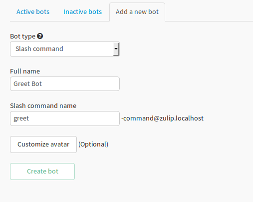

# Slash commands

These are integrations which run inside Zulip and make use of Zulip's codebase. They are triggered by appending
a `/` in the starting of the command. Example: slash command `greet` will be triggered by calling `/greet`
in the message. Since they run inside Zulip, they can make use of internal zulip's codebase and functions to
perform their task. It is this speciality which differentiates them from bots.

## Adding a slash command
1.  Create a new bot of `SLASH_COMMAND` bot type from the `Add a new bot` form. Fill `Slash command name` with
    the desired name of slash command. Note: the command name should **not** contain a `/` prepended to it.
    Example: `greet` is valid but `/greet` is invalid. The bots would have command of the form
    `<command_name>-command@<domain>`.

    

2.  Define the slash command class in `zerver/slash_commands` directory, by extending the `SlashCommandHandler`
    class from `zerver.slash_commands.slash_command_handler`. The class should atleast over write `handle_event`
    method, which would contain the main logic of the command. Method `send_reply` is provided to send reply
    into the Zulip realm. This is done to hide away the complexity of sending the message from the command
    developer.

3.  Finally import the command class in `zerver/slash_commands/__init__.py` and add an entry in
    `AVAILABLE_SLASH_COMMANDS` with the command name as key and command class as the value. Note: the command
    name here should **not** have a `/` prepended to it.

Note: To be able to post the response messages in the stream, the slash command bot should be subscribed to the
corresponding stream.
